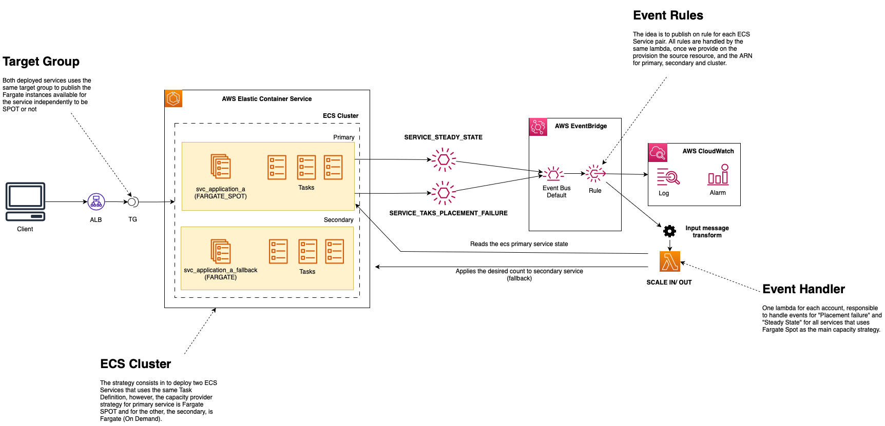

# Solution Overview



# How to test

```
{
    "version": "0",
    "id": "c8909073-5312-0734-85ac-9c312b2e4c43",
    "detail-type": "ECS Service Action",
    "source": "aws.ecs",
    "account": "175898361931",
    "time": "2023-01-05T11:45:20Z",
    "region": "us-east-1",
    "resources": [
        "arn:aws:ecs:us-east-1:175898361931:service/demo/httpbin-service-fargate"
    ],
    "detail": {
        "eventType": "INFO",
        "eventName": "SERVICE_TASK_PLACEMENT_FAILURE",
        "clusterArn": "arn:aws:ecs:us-east-1:175898361931:cluster/demo",
        "createdAt": "2023-01-05T11:45:20.200Z"
    }
}

```

**Event Detail Type:** "ECS Service Action"
**Event source:** "test"
**Event Resource:** arn:aws:ecs:us-east-1:175898361931:service/demo/httpbin-service-fargate
**Event detail:**

```
{
    "eventType": "INFO",
    "eventName": "SERVICE_TASK_PLACEMENT_FAILURE",
    "clusterArn": "arn:aws:ecs:us-east-1:175898361931:cluster/demo",
    "createdAt": "2023-01-05T11:45:20.200Z"
}
```
